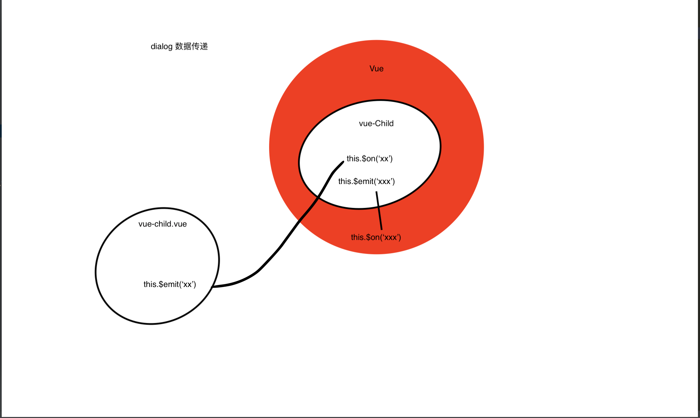
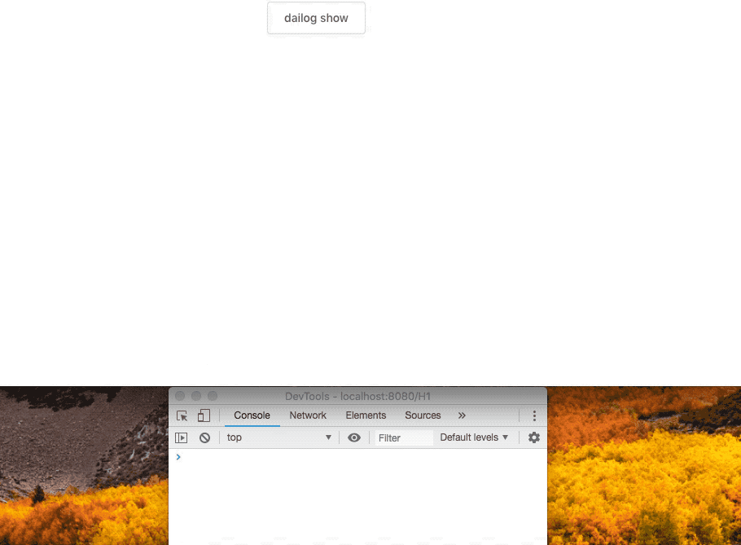

## 这个一个，基于elemnt-ui dailog组件， 封装的一个自定义模版内容弹出框组件， 主要用于Vue项目， 多弹框页面的使用， 能有效果的明确数据的传递逻辑，使得页面逻辑更加清晰， 使用起来更加方便，提高代码的可维护性。

### 数据流向图解:


### dailog 使用方法
```javascript
    this.$dailog(template, prop).$on('ok', data => {
        // data 为最终确定 提交过来的数据
    });
```
### .vue文件完整示例
- 1、方法调用 .vue文件
```vue
    <template>
        <div> </div>
    </template>
    <style></style>
    <script>
        import template from './template.vue';
        export default {
            data() {
                return {};
            },
            methods: {
                showDailog() {
                    this.$dailog(tempalte).$on('ok', data => {
                        console.log('传过来的数据', data);
                    });
                }
            };
        }
    </script>
```
- 2、弹出框 .vue文件(即 上述 template.vue文件)
```vue
    <template>
        <div> 我是弹出框 </div>
          <span slot="footer" class="dialog-footer">
            <el-button type="default" @click="save">确定</el-button>
            <el-button type="default" @click="$emit('close')">取消</el-button>
          </span>
    </template>
    <style></style>
    <script>
        export default {
            data() {
                return {
                    form: {}
                }
            },
            mounted() {},
            methods: {
                save() {
                    this.$emit('ok', JSON.parse(JSON.stringfiy(this.form)));
                }
            }
        };
    </script>
```
- 3、插件注册、安装 main.js 启动文件
```javascript
   ...
   import Dailog form './dailog/index';
   Vue.use(Dailog);
```
### 效果图



