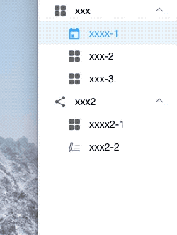

## 介绍
```
  这是一个基于element-ui 的导航菜单组件基础上, 进行二次封装的菜单组件，以递归方式，接受JSON菜单数据，进行渲染。
```
## 使用方法
```
 安装了element-ui后，直接把相应.vue文件引入项目中， 当组件使用即可。
```
## 使用示例
 ```html
<template>
    <el-container class="v-report-index">
        <el-aside  style="width: 200px; overflow-x: hidden;">
            <my-menu
                :default-active="defaultActive"
                :menu-data="reportData"
                @select="handleClick">
            </my-menu>
        </el-aside>
        <el-main>
            <router-view></router-view>
        </el-main>
    </el-container>
</template>
<style lang="less" rel="stylesheet/less" scoped>
@import '../../../assets/css/variable';
    .v-report-index {
        height: 100%;
        > .el-aside {
            h2 {
                margin: 8px 16px;
                font-size: 18px;
            }
            border-right: 1px solid @border-color-light;
        }
    }
</style>
<style lang="less"  rel="stylesheet/less">
    .v-report-index {
        .el-menu-item.is-active {
            background-color: #eaf6ff;
        }
    }
</style>
<script>

import MyMenu from './componets/my-menu.vue';
export default {
    componentName: 'ReportIndex',
    components: {
        MyMenu
    },
    data() {
        return {
            defaultActive: '',
            reportData: [{
                key: 'report',
                name: 'xxx',
                icon: 'el-icon-menu',
                children: [{
                    key: 'case',
                    name: 'xxxx-1',
                    icon: 'el-icon-date'
                }, {
                    key: 2,
                    name: 'xxx-2',
                    icon: 'el-icon-menu'
                }, {
                    key: 3,
                    name: 'xxx-3',
                    icon: 'el-icon-menu'
                }]
            }, {
                name: 'xxx2',
                icon: 'el-icon-share',
                children: [{
                    key: 'person',
                    name: 'xxxx2-1',
                    icon: 'el-icon-menu'
                }, {
                    key: 'personDetail',
                    name: 'xxx2-2',
                    icon: 'el-icon-mobile-phone'
                }]
            }]
        };
    },
    methods: {
        handleClick(index, indexPath) {
             // ......
        }
    }
};
</script>
 ```
## 选项
属性 | 描述 |  类型  
-|-|-
menuData | 菜单数据 | Array |
defaultActive | 菜单激活项 | String/Number |
select | 选中事件 | Function（index, indexPath), 两个参数..|
```
 其余选项请 根据实际项目需求， 参照elment-ui文档进行扩展。
```
## 效果图

